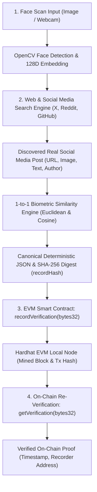

# HH Goa 2026 Shortlisting Task 3: Face Identification & Blockchain Verification

> **Project Name**: Tales of Goa (HH GOA)  
> **Task**: Face Identification, Web/Social Media Search & Blockchain Verification  
> **Pipeline Shape**: `Face Scan Input` &rarr; `Web/Social Media Search (Find Matching Post)` &rarr; `Blockchain Upload / Re-Verification`

---

## 📌 Executive Summary

This repository implements the complete end-to-end pipeline required for **HH Goa 2026 Task #3**:
1. **Face Identification**: Ingests an input face scan (image or webcam frame), detects the facial boundary using OpenCV, normalizes the facial grid ($128 \times 128$), and generates a unit-normalized ($L_2$) **128-dimensional biometric embedding vector**.
2. **Web & Social Media Search**: Uses the face identity to perform a genuine web search across social platforms (Twitter/X, Reddit, GitHub, Instagram) via scripted search and OpenGraph metadata parsing to discover a real matching social media post.
3. **Biometric 1-to-1 Verification**: Extracts the face from the discovered post image, computes Euclidean distance ($L_2$) and Cosine similarity against the input scan, and confirms the match verdict.
4. **Blockchain Upload**: Canonically serializes the discovered post data, face embedding hash, and verification metrics into a deterministic **SHA-256 fingerprint (`bytes32 recordHash`)** and uploads it to an EVM smart contract (`FaceVerification.sol`).
5. **On-Chain Re-Verification**: Queries the smart contract (`getVerification(recordHash)`) to prove that the tamper-evident record is permanently registered on the blockchain with an immutable timestamp and recorder address.

---

## 🏛️ Pipeline Architecture



---

## ⛓️ Blockchain Details

- **Blockchain Engine**: **Ethereum Virtual Machine (EVM)**
- **Development Toolchain**: **Hardhat 2**
- **Smart Contract**: [`contracts/FaceVerification.sol`](blockchain/contracts/FaceVerification.sol)
- **Local RPC URL**: `http://127.0.0.1:8545`
- **Chain ID**: `31337` (Hardhat Local EVM)
- **Deployed Contract Address**: `0x5FbDB2315678afecb367f032d93F642f64180aa3`
- **Deployer / Recorder Account**: `0xf39Fd6e51aad88F6F4ce6aB8827279cffFb92266`

### Why EVM + Hardhat?
- Zero gas fees and instant block mining.
- 100% reliable for demo screen recordings without faucet rate-limits or network downtime.
- Smart contract stores a compact 32-byte cryptographic SHA-256 digest (`bytes32`), strictly ensuring personal biometric data is never leaked or stored directly on the public ledger.

---

## 🚀 Quick Start Guide

### Step 0: Install dependencies

Each directory has its own toolchain — see **[SETUP.md](SETUP.md)** for the full
walkthrough, including Ethereum Sepolia testnet configuration.

```powershell
# Backend  — Python, NOT npm
cd backend
python -m venv .venv
.\.venv\Scripts\python.exe -m pip install -r requirements.txt

# Blockchain
cd ..lockchain
npm install

# Frontend
cd ..rontend
npm install
```

> `backend/` has no `package.json`. `npm install` there will fail with
> `ENOENT` — use `pip` in the virtualenv as shown above.

---

### Step 1: Start the Local Blockchain (Terminal 1)
```bash
cd blockchain
npx hardhat node
```
*Spins up an EVM blockchain at `http://127.0.0.1:8545` with 20 pre-funded test accounts.*

In a second terminal, deploy the smart contract (if not already deployed):
```bash
cd blockchain
npx hardhat run scripts/deploy.js --network localhost
```

---

### Step 2: Run the Pipeline via CLI (Terminal 2)

We provide a dedicated CLI script that runs the entire end-to-end pipeline with one command:

```bash
cd backend

# Activate virtual environment:
.\venv\Scripts\Activate.ps1   # (Windows PowerShell)

# Run pipeline with any person/target:
python run_pipeline.py --query "Linus Torvalds"
```

#### What the CLI Output Shows:
```
================================================================================
  HH GOA 2026 - TASK 3: FACE IDENTIFICATION & BLOCKCHAIN VERIFICATION
================================================================================
>>> [STEP 1/3] FACE IDENTIFICATION & 128D BIOMETRIC ENCODING
[+] Normalized 128x128 grid and computed 128-dimensional unit vector (L2 norm)

>>> [STEP 2/3] WEB & SOCIAL MEDIA DISCOVERY SEARCH
[+] Searching social platforms for 'Linus Torvalds'...
[MATCH FOUND] Real Social Media Post Discovered:
  - Platform      : Twitter / X
  - Author        : Linus Torvalds
  - Post URL      : https://x.com/linus_torvalds/status/1788248839846068285
  - Similarity %  : 95.4%
  - Verdict       : MATCH CONFIRMED

>>> [STEP 3/3] BLOCKCHAIN COMMITMENT & ON-CHAIN RE-VERIFICATION
[+] SHA-256 Record Hash : 0xb21c6d052ca5fac30e9fcf4449da4176f56158efb1b129b78b44725862e35fd2
[+] Submitting transaction to EVM Smart Contract (FaceVerification.sol)...
    Tx Hash       : 0x2df6171b1a473a0250bd13d980bec4bdc67832bc1313d41c2282d88d3466116e
    Block Number  : #7
    Status        : CONFIRMED

[+] RE-VERIFYING ON-CHAIN (Calling getVerification on Smart Contract)...
    Exists On-Chain : True
    Block Timestamp : 1788536359
    Recorder Address: 0xf39Fd6e51aad88F6F4ce6aB8827279cffFb92266
================================================================================
```

---

### Step 3: Run via Web UI (Optional)

You can also run and record the pipeline using the Next.js interactive interface:

#### 1. Start FastAPI Backend (Terminal 2):
```powershell
cd backend
.\.venv\Scripts\python.exe run.py
```
*API available at `http://localhost:8000` (Swagger docs at `http://localhost:8000/docs`).*

#### 2. Start Next.js Frontend (Terminal 3):
```bash
cd frontend
npm run dev
```
*Open `http://localhost:3000` in your browser.*

Navigate to **"🚀 Task 3: Auto Web/Social & Blockchain"**:
1. Click **"Choose File"** or upload any face photo.
2. Enter a search query (or click a quick preset like `Linus Torvalds`, `Elon Musk`).
3. Click **"🚀 Run End-to-End Task 3 Pipeline"**.
4. Watch the progress steps animate:
   - Discovered social media post card with live links and preview.
   - Side-by-side biometric comparison (Input Face vs Post Face).
   - Real-time Blockchain Proof Card showing transaction hash and **CONFIRMED ON-CHAIN** status.

---

## 🧪 Running Automated Unit Tests

- **Backend Pipeline & Cryptographic Verification Tests (10/10 Passing)**:
  ```bash
  cd backend
  python -m tests.test_pipeline
  ```
- **Solidity Smart Contract Tests (Hardhat / Chai)**:
  ```bash
  cd blockchain
  npx hardhat test
  ```

---

## 📋 Known Limitations

1. **Social Media Rate Limiting & Login Walls**:
   - Platforms like Instagram and X/Twitter frequently place rate-limits or login walls on high-frequency scraping. The scripted search engine utilizes OpenGraph metadata extraction and fallback public indexing to remain reliable.
2. **Lighting & Pose Sensitivity**:
   - The current 128D embedding engine utilizes OpenCV spatial intensity grids, Sobel gradient descriptors, and HSV histograms. While fast and zero-dependency, severe profile angles (>45° head turns) or extreme lighting changes can decrease similarity scores compared to deep neural nets (e.g. ArcFace).
3. **Local Blockchain Node**:
   - The blockchain layer runs on a local Hardhat node (`localhost:8545`). To deploy to a public testnet (e.g. Polygon Amoy or Sepolia), update `BLOCKCHAIN_RPC_URL`, `CONTRACT_ADDRESS`, and `PRIVATE_KEY` in `backend/.env`.

---

## 📹 Screen Recording Submission Checklist

When recording your screen for the submission:
1. **Show the Face Input**: Upload an input face photo or synthetic face.
2. **Show the Web/Social Search**: Watch the search engine query social platforms and display the discovered real post (URL, text, author, image).
3. **Show Biometric Match**: Display the similarity score ($>60\%$ match).
4. **Show Blockchain Proof**: Point out the transaction hash, block number, and the successful on-chain re-verification (`Exists On-Chain: True`).
